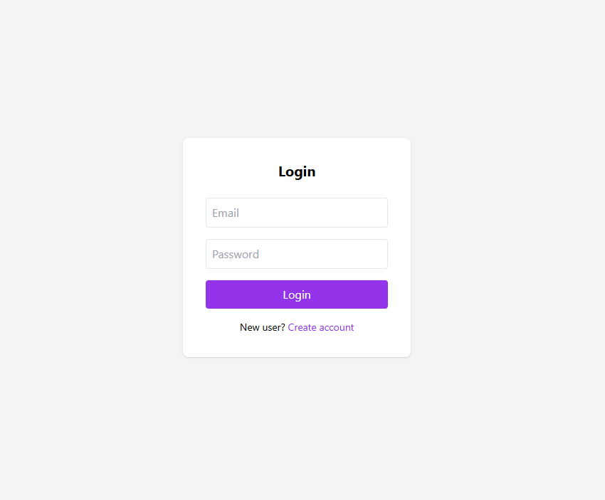
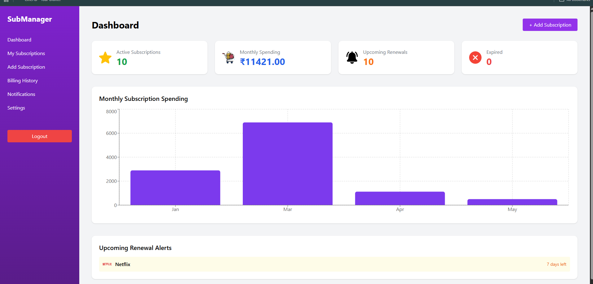
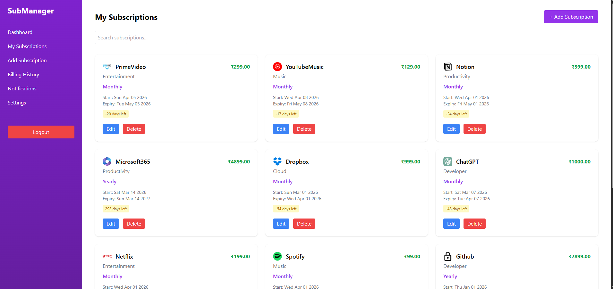
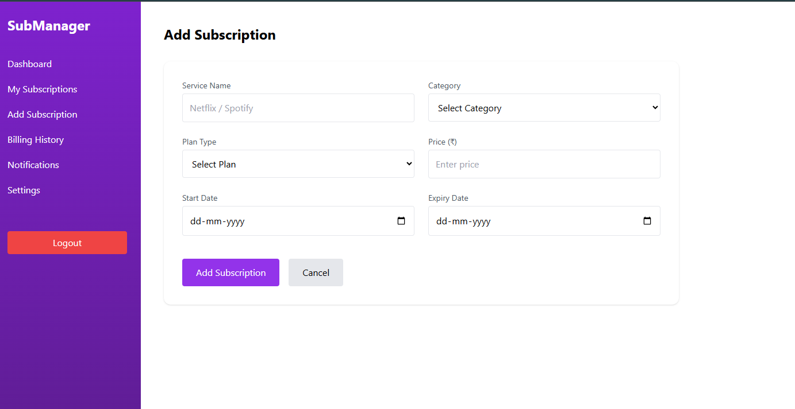
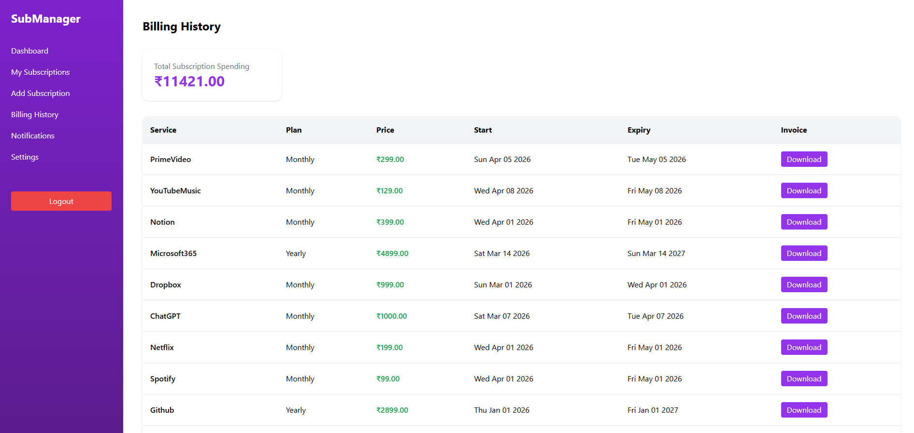
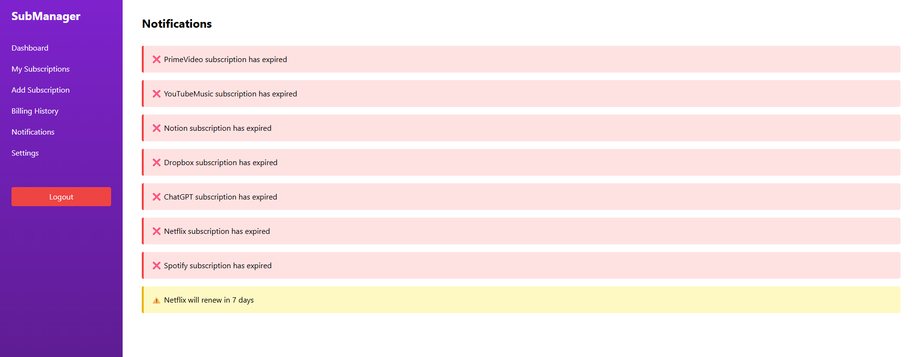
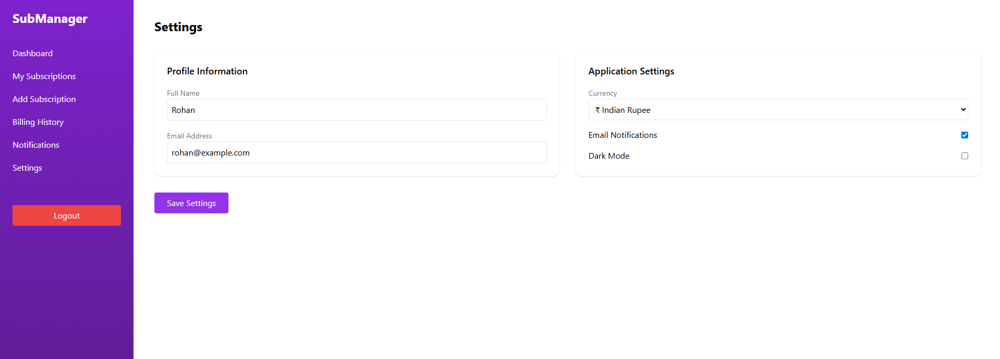

# Subscription Management System

A modern full-stack subscription management platform built using React, Flask, and MySQL for efficiently managing digital subscriptions and billing history.

---

# Features

- User Login & Signup Authentication
- Dashboard Analytics
- Add & Manage Subscriptions
- Billing History Tracking
- Notifications System
- Settings Management
- Responsive User Interface
- MySQL Database Integration

---

# Tech Stack

## Frontend
- React.js
- Tailwind CSS
- Vite

## Backend
- Flask (Python)

## Database
- MySQL Workbench / MySQL Server

---

# Project Structure

```bash
subscription-management-system/
│
├── backend/
├── frontend/
├── screenshots/
└── README.md
```

---

# Installation Guide

## Frontend Setup

```bash
cd frontend
npm install
npm run dev
```

## Backend Setup

```bash
cd backend
pip install -r requirements.txt
python app.py
```

---

# Application Screenshots

## Login Page



---

## Signup Page


---

## Dashboard



---

## My Subscription Page



---

## Add Subscription Page



---

## Billing History



---

## Notifications Page



---

## Settings Page



---

# Future Enhancements

- Email Notifications
- Payment Gateway Integration
- Subscription Renewal Alerts
- Cloud Deployment
- User Profile Management
- Dark Mode Support

---

# Author

Rohan G

---

# License

This project is developed for educational and learning purposes.